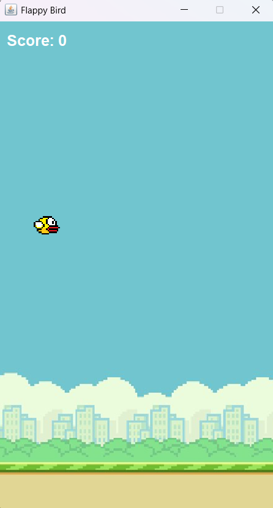

# TP6DPBO2025C2

Saya Rexy Putra Nur Laksana dengan NIM 2309578 mengerjakan soal TP 6 dalam mata kuliah Desain dan Pemrograman Berorientasi Objek untuk keberkahanNya maka saya tidak melakukan kecurangan seperti yang telah dispesifikasikan. Aamiin.

# Desain Program
---
Flappy Bird adalah game sederhana di mana pemain mengontrol seekor burung untuk menghindari pipa-pipa yang muncul secara acak. Game ini dibangun menggunakan Java Swing.

## 🎮 Fitur Utama
- Tampilan grafis 2D menggunakan `JPanel` dan `Graphics`
- Gerakan burung dengan tombol **Space**
- Restart game dengan menekan tomobol **R**
- Sistem skor otomatis saat melewati pipa
- Tampilan **Game Over** dan opsi restart
- Efek suara saat burung terbang

## 🛠️ Teknologi yang Digunakan
- Java SE
- Java Swing (`JPanel`, `JLabel`, `Timer`, `KeyListener`)
- ImageIcon untuk menampilkan gambar
- Java Sound API untuk efek suara

## 🗂️ Struktur Kelas

### `FlappyBird.java`
Kelas utama yang mengatur:
- Inisialisasi game (ukuran frame, gambar, objek)
- Gerakan burung dan pipa
- Deteksi tabrakan
- Penghitungan skor
- Tampilan `Game Over`
- Event listener keyboard

### `Player.java`
Kelas untuk burung (player), berisi:
- Posisi X dan Y
- Kecepatan jatuh (`velocityY`)
- Ukuran dan gambar

### `Pipe.java`
Kelas untuk pipa, berisi:
- Posisi X dan Y
- Kecepatan gerak
- Gambar pipa (atas/bawah)
- Flag `scored` untuk menghitung skor satu kali

## 🎨 Asset
Letakkan gambar dan suara di folder `assets/`:

# Alur Permainan
---
1. Program dimulai dengan menampilkan **Main Menu**.
2. Saat tombol "Start" ditekan, game akan dimulai.
3. Pemain menekan tombol **Space** untuk membuat burung melompat.
4. Pemain harus menghindari pipa yang terus bergerak.
5. Skor bertambah setiap kali melewati pipa.
6. Game berakhir atau game over jika burung menabrak pipa atau jatuh ke bawah.
7. Tekan tombol **R** untuk me-restart game setelah Game Over.

# Dokumentasi
---

## Main Menu

## Gameplay

## Game Over

